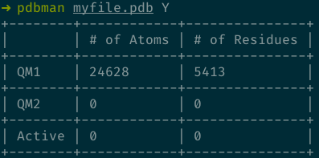
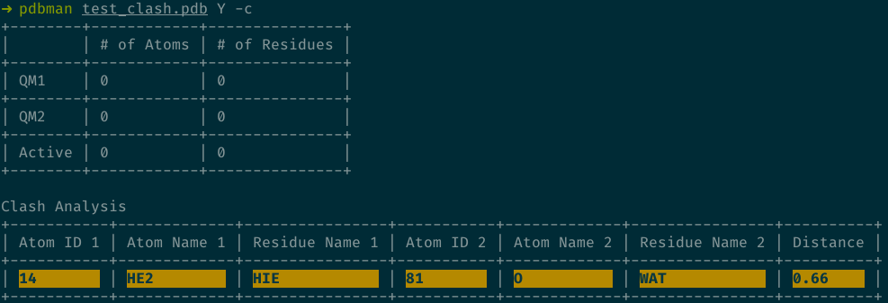
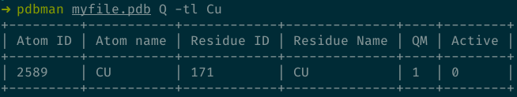
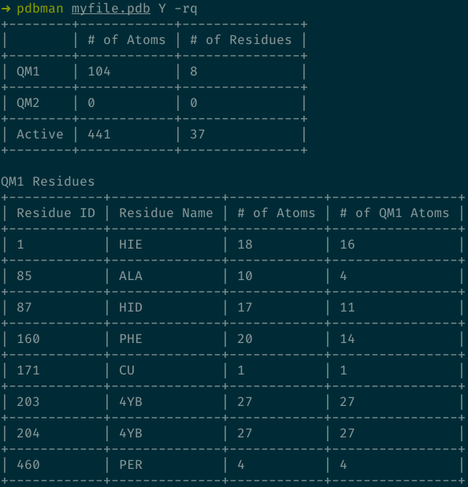

# pdbman
Analyzes and modifies PDB files for QM/MM calculations.

## Description
This program takes a PDB file as input and analyzes or changes it as needed to
serve as input for Orca QM/MM calculations. 

Note that for the time being two version of this software is provided: a Python and a Rust version. They are roughly equal in terms of features with the Rust version being faster and more actively developed. The Python version will be deprecated at some point.

### Capabilities
- Query specific atoms and residues by ID or name
- Find atoms or residues within a user-defined sphere of a given atom
- Analyze atoms and/or residues present in QM or active region
- Find clashes and atomic contacts in given PDB file
- Add or remove atoms or residues to QM or active region by ID or name
- Add or remove atoms and residues to QM or active region by calculating a sphere of given radius around a given atom
- Add or remove only the sidechain or backbone of residues by ID or name
- Edit PDB file in place
- Write edited PDB file to separate file

The several options are provided via command line flags (the ordering of the flags does not matter). Additional information can be obtained from `pdbman --help`

---

### Options
Four different subcommands are available (equivalent aliases given in parentheses):

- `Analyze` (`analyze`, `ana`, `Y`, `y`), analyzes the QM and active region definitions currently in place
- `Remove` (`remove`, `rem`, `R`, `r`), removes atoms or residues from QM or active region
- `Add` (`add`, `A`, `a`), adds atoms or residues from QM or active regions
- `Query` (`query`, `que`, `Q`, `q`), queries the PDB file for information on atoms, residues, atom names etc.

Each subcommand can be called by any of its aliases like so:

`pdbman myfile.pdb analyze`

`pdbman myfile.pdb rem`

`pdbman myfile.pdb A -rql 1,5,18`

&nbsp;

Each subcommand has a set of options they accept which are in turn divided into groups:

#### Region
Defines which region pdbman acts on. Relevant for `Add`, `Remove` and `Analyze` subcommands.

- QM1 (`-q`)
- QM2 (`-o`), this is only relevant for ONIOM calculations.
- Active (`-a`)

#### Target
Defines whether atoms or residues are targeted. Relevant for all subcommands.

- atoms (`-t`)
- residues (`-r`)

#### Source
The source of user-input. Relevant for `Add`, `Remove` and `Query` subcommands.

- list (`-l`), takes a comma-separated list of IDs **or** names, ranges are also supported.
- sphere (`-s`), takes an atom ID and a radius in Angström as arguments.

#### Partials
For cases when only a part of one or more residues should be manipulated. Relevant for `Add` and `Remove` subcommands. Requires the `residues` option.

- backbone (`-b`)
- sidechain (`-d`)

#### Output
Defines how `pdbman` returns edited PDB files. If no option is given, output is printed to stdout.

Not all options are compatible with each other which will not be described in detail here. The program will determine at runtime if your input is valid and will tell you if not. Help messages are available for all subcommands like so:

`pdbman Add --help`

## Installation

### Binary

Linux and Windows executables are provided (`pdbman` and `pdbman.exe`, respectively). Just put them somewhere in your $PATH and you're good to go.

### From Source
In case you're on MacOS or the provided executables do not work (e.g. because of outdated versions of underlying libraries), you need to compile fom source:

1. Download `rustup` from [here](https://rustup.rs/) and follow installation instructions
2. Download the `src` folder, the `cargo.toml` file and put them in a directory as they are.
3. Open a terminal, navigate to the folder containing `src` and `cargo.toml`
4. Type `cargo install --path .` (Do not forget the dot)

Rust will now compile the binary and place it in your cargo root folder (location differs based on operating system). It can now be accessed from the command line without any further steps.

## Usage

As illustration what `pdbman` is capable of a typical workflow will be shown.

First, the file of interest (here called `myfile.pdb`) will be analyzed:

`pdbman myfile.pdb Y`

This is typical for files that were preprocessed with Ambertools and needs to be changed.
Next, we look for potential clashes between atoms. This can happen if, e.g., a water shell has been added around the molecule and results in spurious high contributions from the involved Lennard-Jones-terms.

`pdbman myfile.pdb Y -c`

(Different input file shown in figure because `myfile.pdb` has no clashes)

This will look for any atoms not belonging to the same residue whose distance is smaller than 1.0 Angströms. If distances are significantly smaller than that they will be highlighted in yellow or red. For more granular control you can also search the local environment of a specific atom like so:

`pdbman myfile.pdb Q -ts 2589 2`

which returns all atoms within 2 Angströms of the atom with ID 2589. Keep in mind that atoms within the same residue are not included here.

In order to make use of the PDB file with ORCA it's usually useful to clean all atoms from QM and active regions and start fresh:

`pdbman R -w`

This overwrites the input PDB file so it can be used for consecutive runs which is the most common workflow.

Next, we want to build an active region of residues around a metal ion in the center of the region of interest to us. In order to find the ID of a suitable atom you can do:

`pdbman myfile.pdb Q -tl Cu`

This finds all atoms with the name `Cu` in the PDB file. The search is case-insensitive. You can also search for residues with the `-r` flag but be aware that the residue names can differ from the usually more intuitive atom names.

After we found the atom ID we need, we can build a spherical active space with a radius of our choosing (in this case 8 Angströms):

`pdbman myfile.pdb A -raws 2589 8`

The radius argument can be any floating point number (i.e. decimal points are allowed). If the `-r` flag is given, all residues that contain an atom within the given radius to the given atom will be included. We can look at the results:

`pdbman myfile.pdb Y`

or with more detail:

`pdbman myfile.pdb Y -ra`

In general it is a good idea to keep checking your progress in case of unanticipated behaviour.
Next, we build a QM region. We have to decide on residues to include here which is usually done via inspection of the active site with some graphical program. Once you decide what to include you can use pdbman to apply it to your PDB file in a few commands.

In this case, we have a mononuclear Cu center, surrounded by several amino acids, a hydrogen peroxide and a polysaccharide. We determined by hand the IDs of the residues to include but in case we forget a number, we can use `pdbman` to query for it like so:

`pdbman myfile.pdb Q -rl HIS`

This searches for all occurences of the residue name 'HIS' (input is case-insensitive) including the atoms in the residues.

In order to finally build our QM region we first add a couple of residues with all atoms:

`pdbman myfile.pdb A -rqwl 1,171,460,203,204`

Since we only want the sidechains of some of the amino acids, we can choose to only add those:

`pdbman myfile.pdb A -rqwdl 85,87,160`

Note that in the case of GLY no atoms will be added to the chosen region. If residue insertion codes are present, these need to be included when residue list inpupt is given like so:

`pdbman myfile.pdb A -rqwl 85A,87A,9999A-4B`

This is mostly relevant if more than 9999 residues are present.

If we now want to make some more granular changes to the QM region we can add or remove specific atoms. First we query for their IDs:

`pdbman myfile.pdb Q -rl 1`

The we remove the carbon and oxygen atom:

`pdbman myfile.pdb R -tqwl 17,18`

The `-l` option supports ranges of atoms or residues which can be given with a dash or colon as separator like so:

`pdbman myfile.pdb A -tqwl 1-8,19:27,5`

A final look at the region declarations we made:

`pdbman myfile.pdb Y`

`pdbman myfile.pdb Y -rq`

Looks good! Now we're good to go for QM/MM jobs!

## Requirements

Tested with `Rust` version > 1.5. Anything below that may or may not work. If you build from source and install `Rust` via rustup for the first time, you'll be fine.

## Known Issues
If there are duplicate residue numbers present in the PDB file, insertion codes need to also be present (in compliance with official guidelines for PDB files) otherwise the program will not work as intended (if the `overwrite` option is chosen, the input PDB file will also be mangled). This can happen, for example, if a solvation box is added.

If such a PDB file was created automatically without insertion codes, these need to be added manually.

## Contributor
Contributed by Benedikt Flöser
